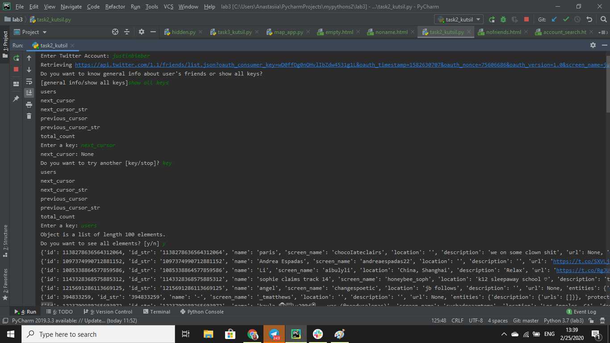

# json file navigation
The program is a realization of navigation through json file. User inputs a profile s/he wants to see information about. The program asks user what s/he wants to see and offers different options to choose from. 

## Example of running a program:

